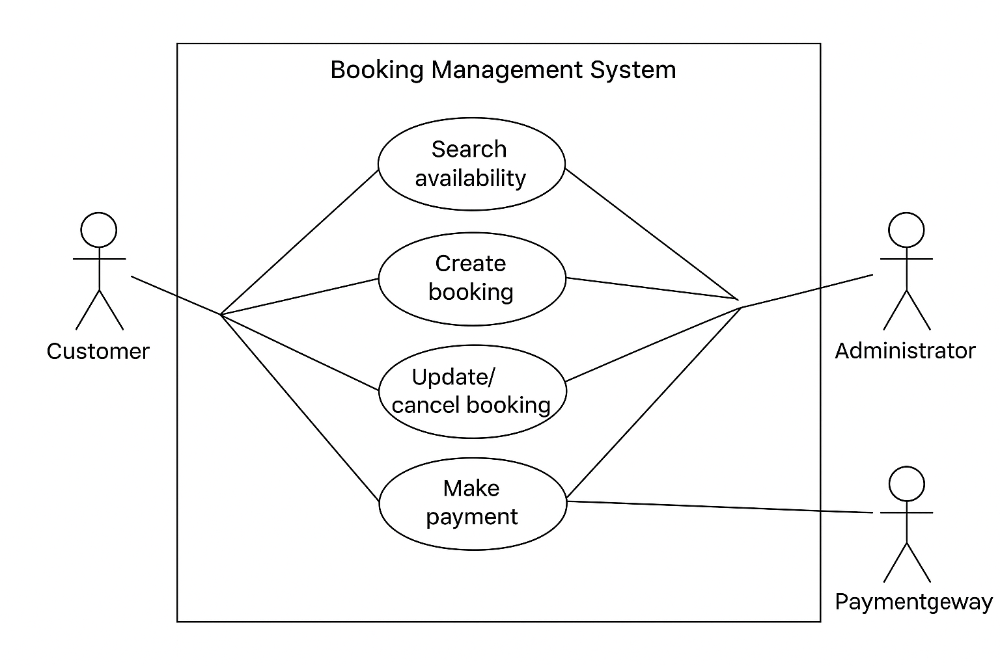

# Requirement Analysis in Software Development.

This repository is dedicated to documenting and analyzing the requirements of a **Booking Management System** as part of the Requirement Analysis Project.  

The purpose of this repository is to:  
- Provide a clear and structured approach to requirement analysis.  
- Differentiate functional and non-functional requirements.  
- Represent system interactions visually using diagrams.  
- Define acceptance criteria to align with business and user needs.  

This serves as the foundation for building robust, scalable, and user-focused software systems. 

## What is Requirement Analysis?  

Requirement Analysis is the process of identifying, gathering, and documenting the needs and expectations of stakeholders for a software system. It is one of the most critical phases in the **Software Development Life Cycle (SDLC)** because it lays the foundation for the entire project.  

During this phase, developers, analysts, and stakeholders work together to clearly define **what the system should do** (functional requirements) and **how it should perform** (non-functional requirements).  

### Importance in the SDLC:
- **Clarity of Goals:** Ensures everyone involved shares the same understanding of the system’s objectives.  
- **Minimizes Errors:** Detects ambiguities, inconsistencies, and gaps early, reducing costly changes later.  
- **Guides Design & Development:** Acts as a blueprint that shapes the architecture, design, and coding of the system.  
- **Facilitates Communication:** Serves as a bridge between stakeholders and developers, making expectations explicit.  
- **Ensures Quality & Alignment:** Establishes measurable acceptance criteria to confirm the final product meets business and user needs.  

In short, Requirement Analysis is about asking the right questions, documenting precise answers, and ensuring that the system being built is the **right solution to the right problem**.  

## Why is Requirement Analysis Important?  

Requirement Analysis is a crucial phase in the **Software Development Life Cycle (SDLC)** because it ensures that the system being developed truly meets the needs of stakeholders. Without it, projects risk failure, cost overruns, or delivering solutions that don’t solve the intended problems.  

Here are three key reasons why Requirement Analysis is critical:  

1. **Prevents Misunderstandings**  
   It creates a clear, shared understanding between stakeholders and developers, reducing the risk of building the wrong solution.  

2. **Saves Time and Cost**  
   By identifying issues, conflicts, and gaps early in the process, Requirement Analysis minimizes costly rework during later stages of development.  

3. **Provides a Blueprint for Development**  
   Requirements act as a foundation for design, coding, and testing. They guide developers in building the system correctly and help testers verify that the final product meets expectations.  

4. **Ensures User Satisfaction** *(bonus point)*  
   Well-defined requirements ensure that the end product addresses real user needs, increasing adoption and long-term success. 

## Key Activities in Requirement Analysis  

Requirement Analysis is not a single step but a series of structured activities that ensure project requirements are accurate, complete, and well understood. The five key activities are:  

- **Requirement Gathering**  
  Collecting raw information about the project from stakeholders, users, and existing documentation. This step focuses on identifying what the system should achieve.  

- **Requirement Elicitation**  
  Engaging stakeholders through techniques like interviews, surveys, brainstorming, workshops, or observation to uncover deeper needs, hidden expectations, and constraints.  

- **Requirement Documentation**  
  Organizing and recording the gathered requirements in a clear and structured way, usually in the form of Software Requirement Specification (SRS) documents, user stories, or use cases.  

- **Requirement Analysis and Modeling**  
  Examining requirements to identify conflicts, priorities, and dependencies. This often includes creating diagrams (like use case diagrams or data flow diagrams) to model how the system will function.  

- **Requirement Validation**  
  Ensuring that the documented requirements are correct, complete, and aligned with stakeholder needs. This step often involves reviews, walkthroughs, or prototyping to confirm accuracy before development begins.  

## Types of Requirements  

In Requirement Analysis, requirements are broadly classified into two categories: **Functional** and **Non-functional**. Both are essential to ensure that the system meets business goals and user expectations.  

### Functional Requirements  

Functional requirements describe **what the system should do**. They define the features, functions, and operations that the system must perform to meet user needs.  

**Examples for a Booking Management System:**  
- Users should be able to create, update, and cancel bookings.  
- The system should allow customers to search for available booking slots by date and time.  
- An administrator should be able to manage resources (e.g., rooms, vehicles, or services) linked to bookings.  
- The system should send confirmation emails or SMS notifications after a booking is made.  
- Users should be able to make payments securely through integrated payment gateways.  

### Non-functional Requirements  

Non-functional requirements describe **how the system should perform** rather than what it should do. They define quality attributes, constraints, and overall system behavior.  

**Examples for a Booking Management System:**  
- The system should handle at least **500 concurrent users** without performance degradation.  
- Response time for searching available bookings should not exceed **2 seconds**.  
- The system should provide **99.9% uptime** to ensure availability.  
- All sensitive data (user details, payment information) must be **encrypted** both in transit and at rest.  
- The interface should be responsive and accessible on desktops, tablets, and mobile devices.

## Use Case Diagrams  

A **Use Case Diagram** is a visual representation of the interactions between system users (actors) and the functions (use cases) that the system provides. It shows **who** uses the system and **what** they can do, helping stakeholders and developers quickly understand system boundaries and functionalities.  

### Benefits of Use Case Diagrams  
- **Clarity:** Provides a simple and visual way to capture system functionality.  
- **Communication:** Bridges the gap between technical teams and non-technical stakeholders.  
- **Scope Definition:** Helps define the system’s boundaries and what will (and won’t) be included.  
- **Requirement Validation:** Ensures all user interactions are identified and addressed.  

### Booking Management System Use Case Diagram  

Actors:  
- **Customer** (makes bookings, manages bookings, makes payments)  
- **Administrator** (manages resources, oversees bookings, generates reports)  
- **Payment Gateway** (handles transactions)  

Use Cases:  
- Search availability  
- Create booking  
- Update/cancel booking  
- Make payment  
- Send confirmation  
- Manage resources  
- Generate reports  

  

## Acceptance Criteria  

**Acceptance Criteria** are the predefined conditions that a software feature must meet to be accepted as complete by stakeholders or end-users. They serve as a checklist to confirm that requirements have been implemented correctly and that the system behaves as expected.  

### Importance of Acceptance Criteria  
- **Clarity:** Provides a shared understanding of what "done" means for a feature.  
- **Validation:** Ensures that each requirement is testable and can be verified.  
- **Alignment:** Keeps developers, testers, and stakeholders aligned on expectations.  
- **Quality Assurance:** Reduces ambiguity and miscommunication by setting measurable outcomes.  

### Example: Checkout Feature (Booking Management System)  

**Feature:** Checkout process for booking payment  

**Acceptance Criteria:**  
- The user must be able to review their booking details (date, time, resource, cost) before payment.  
- The system must support multiple payment options (e.g., credit card, PayPal).  
- Payment must be securely processed via the external payment gateway.  
- A confirmation message and receipt must be displayed immediately after successful payment.  
- The system must send a confirmation email or SMS to the user after payment is completed.  
- If payment fails, the user must see an error message and have the option to retry.  

